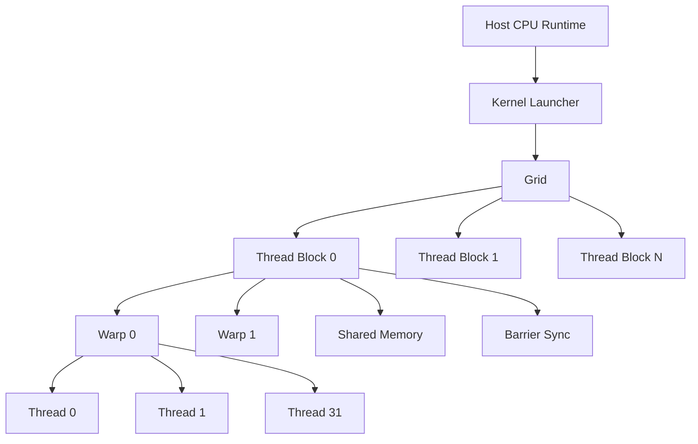

# WarpSpeed — SIMT GPU Architecture Simulator

A modern CUDA-inspired GPU simulator built in **C++17** that models **SIMT execution**, **warps**, **thread blocks**, **shared memory**, and **synchronization primitives** entirely on the CPU using `std::thread`.

Designed for students, researchers, and systems programmers who want to understand GPU architecture internals without requiring NVIDIA hardware.

---

<p align="center">


</p>

---

# Table of Contents

* [Overview](#overview)
* [Key Features](#key-features)
* [Architecture](#architecture)
* [Execution Pipeline](#execution-pipeline)
* [Project Structure](#project-structure)
* [Building](#building)
* [Running the Simulator](#running-the-simulator)
* [GPU Programming Concepts](#gpu-programming-concepts)
* [Kernel Examples](#kernel-examples)
* [Memory Model](#memory-model)
* [Synchronization Model](#synchronization-model)
* [Performance Optimizations](#performance-optimizations)
* [Mini Architecture Diagrams](#mini-architecture-diagrams)
* [Roadmap](#roadmap)
* [Contributing](#contributing)
* [License](#license)

---

# Overview

WarpSpeed simulates core GPU execution principles found in CUDA/OpenCL-style architectures using portable modern C++.

The simulator provides a simplified but educational model of:

* SIMT execution
* Warp scheduling
* Parallel thread execution
* Shared memory
* Synchronization barriers
* Thread blocks
* Parallel reduction patterns
* GPU kernel execution

This project is ideal for:

* Computer architecture students
* Parallel programming learners
* CUDA beginners
* Systems researchers
* Compiler/runtime experimentation

---

# Key Features

## Core GPU Simulation

* SIMT (Single Instruction Multiple Threads)
* Warp-based execution model
* Cooperative thread blocks
* Shared memory simulation
* Barrier synchronization
* Parallel kernel launching

---

## Parallel Execution Engine

* CPU-thread-backed GPU threads
* Warp grouping abstraction
* Block-level synchronization
* Dynamic thread scheduling
* Parallel execution tracing

---

## Educational Focus

* Clean modular architecture
* Minimal dependencies
* Readable C++17 implementation
* Easy kernel experimentation
* Architecture visualization support

---

# Architecture



---

# Execution Pipeline

```text
Host Program
      ↓
Kernel Launch
      ↓
Grid Creation
      ↓
Thread Block Dispatch
      ↓
Warp Scheduling
      ↓
SIMT Thread Execution
      ↓
Barrier Synchronization
      ↓
Shared Memory Operations
      ↓
Kernel Completion
```

---

# Project Structure

```text
WarpSpeed/
│
├── src/
│   ├── gpu_simulator.cpp
│   ├── thread_block.cpp
│   ├── warp.cpp
│   ├── barrier.cpp
│   ├── shared_memory.cpp
│   └── kernels.cpp
│
├── include/
│   ├── gpu_simulator.hpp
│   ├── thread_context.hpp
│   ├── barrier.hpp
│   ├── shared_memory.hpp
│   └── kernels.hpp
│
├── examples/
│   ├── reduction.cpp
│   ├── stencil.cpp
│   └── scan.cpp
│
├── build/
├── CMakeLists.txt
├── LICENSE
└── README.md
```

---

# Building

## Prerequisites

* C++17 compatible compiler
* CMake 3.10+
* Linux / macOS / Windows

---

## Build Instructions

```bash
git clone https://github.com/jsramesh1990/WarpSpeed---SIMT-GPU-Simulator.git

cd WarpSpeed---SIMT-GPU-Simulator

mkdir build
cd build

cmake ..
make
```

---

# Running the Simulator

## Main GPU Simulator

```bash
./gpu_simulator
```

---

## Demo Examples

```bash
./gpu_demo
```

---

# GPU Programming Concepts

## SIMT — Single Instruction Multiple Threads

SIMT allows multiple threads to execute the same instruction simultaneously.

```text
Instruction Stream
        ↓
 ┌───────────────┐
 │ Warp Scheduler│
 └───────────────┘
        ↓
Thread0 Thread1 Thread2 ... Thread31
```

---

## Warp

A warp is a group of threads executing together.

### Warp Characteristics

| Property            | Value      |
| ------------------- | ---------- |
| Warp Size           | 32 Threads |
| Execution Style     | Lockstep   |
| Scheduling Unit     | Warp       |
| Divergence Handling | Serialized |

---

## Thread Block

Thread blocks contain multiple warps sharing:

* Shared memory
* Synchronization barriers
* Cooperative execution

---

# Kernel Examples

## Parallel Reduction Kernel

```cpp
auto reduction = [&](ThreadContext& ctx,
                     SharedMemory& shared,
                     Barrier& barrier) {

    shared[ctx.threadId] = input[ctx.threadId];

    barrier.sync();

    for (int stride = N / 2; stride > 0; stride /= 2) {

        if (ctx.threadId < stride) {

            shared[ctx.threadId] +=
                shared[ctx.threadId + stride];
        }

        barrier.sync();
    }
};
```

---

## Stencil Computation

```text
Input Array
 ┌──────────────────┐
 │ 1 2 3 4 5 6 7 8  │
 └──────────────────┘

Stencil Window
      [x-1 x x+1]

Output Array
 ┌──────────────────┐
 │ 3 6 9 12 15 ...  │
 └──────────────────┘
```

---

## Prefix Scan

```text
Input:
[1 2 3 4]

Prefix Scan:
[1 3 6 10]
```

---

# Memory Model

## Shared Memory

Shared memory acts as a programmable cache shared by all threads inside a block.

### Advantages

* Very low latency
* Fast thread communication
* Reduced global memory access
* Cooperative computations

---

## Shared Memory Layout

```text
┌──────────────────────────┐
│ Shared Memory (Per Block)│
├──────────────────────────┤
│ Thread 0 Data            │
│ Thread 1 Data            │
│ Thread 2 Data            │
│ ...                      │
└──────────────────────────┘
```

---

# Synchronization Model

## Barrier Synchronization

WarpSpeed models CUDA-style:

```cpp
__syncthreads();
```

using:

```cpp
barrier.sync();
```

---

## Synchronization Flow

```text
Thread 0 ─┐
Thread 1 ─┤
Thread 2 ─┤ WAIT
Thread N ─┘
      ↓
Continue Execution
```

---

# Performance Optimizations

## Recommended Practices

### Minimize Barrier Usage

Too many synchronization points reduce throughput.

---

### Avoid Warp Divergence

Bad:

```cpp
if (threadId % 2 == 0)
    executeA();
else
    executeB();
```

Good:

```cpp
executeSameInstruction();
```

---

### Shared Memory Coalescing

Efficient memory access patterns improve throughput.

---

### Reduce Bank Conflicts

Avoid multiple threads accessing the same memory bank simultaneously.

---

# Mini Architecture Diagrams

## GPU Thread Hierarchy

```text
GPU
│
├── Grid
│   ├── Block 0
│   │   ├── Warp 0
│   │   └── Warp 1
│   │
│   └── Block 1
│
└── Shared Resources
```

---

## SIMT Execution Model

```text
Single Instruction
        ↓
┌────────────────────┐
│ Warp Execution Unit│
└────────────────────┘
        ↓
32 Parallel Threads
```

---

## Shared Memory Communication

```text
Thread A ─┐
Thread B ─┼── Shared Memory
Thread C ─┘
```

---

# Roadmap

## Planned Features

* Cycle-accurate GPU simulation
* Warp scheduler visualization
* Occupancy analysis
* Global memory hierarchy
* L1 / L2 cache simulation
* Memory coalescing visualization
* Performance counters
* PTX-like instruction simulation
* Branch divergence tracking
* Web-based visual debugger

---

# Learning Outcomes

By exploring WarpSpeed, users will learn:

* GPU execution fundamentals
* Parallel programming models
* SIMT architecture design
* Warp scheduling
* Synchronization techniques
* Shared memory optimization
* Reduction and scan algorithms

---

# Contributing

Contributions are welcome.

## Suggested Areas

* New GPU kernels
* Scheduling algorithms
* Performance profiling
* Memory system extensions
* Visualization tools
* Documentation improvements

---

## Contribution Workflow

```bash
# Fork repository

# Create feature branch
git checkout -b feature/new-feature

# Commit changes
git commit -m "Add new feature"

# Push changes
git push origin feature/new-feature
```

Then open a Pull Request.

---

# License

This project is licensed under the MIT License.

---

# About

WarpSpeed brings CUDA-inspired GPU programming concepts to standard modern C++.

Learn:

* GPU architecture
* SIMT execution
* Parallel computing
* Synchronization primitives
* Shared memory optimization

without requiring physical GPU hardware.

---

<p align="center">

### ⭐ If you like this project, consider starring the repository.

</p>
